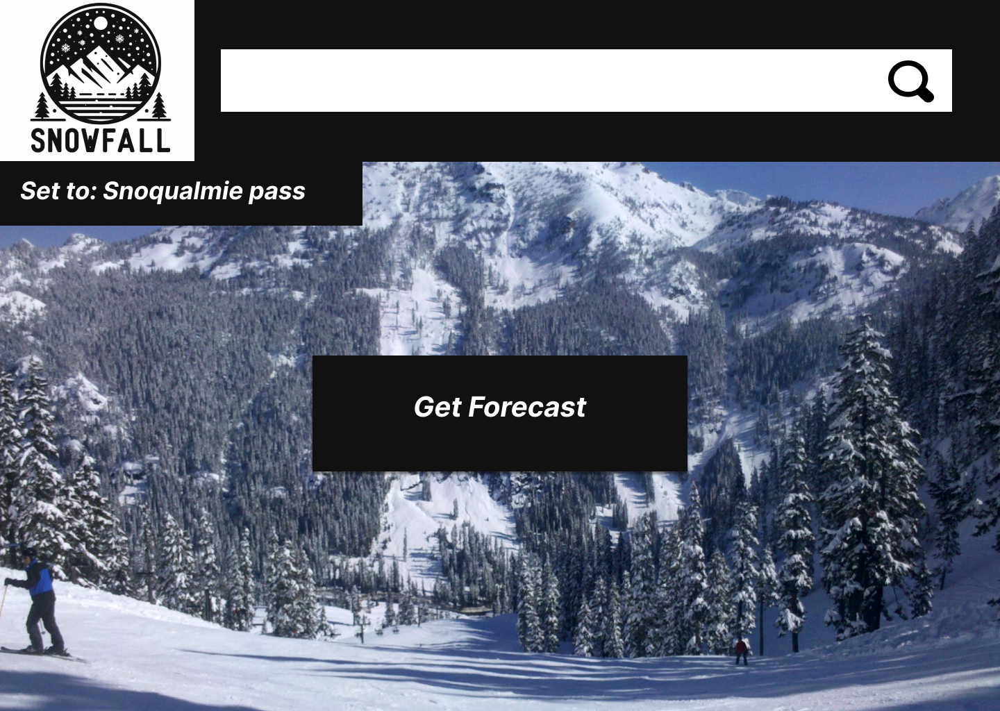

<h1>Software Requirements Specifications 
for 
Snow Predictions</h1>

<h2> Version 1.0 approved 
 
Prepared by Frank Vanris, Conrad Nark,  Stefana Ciustea  
Bellevue College  
4/9/2024  </h2>

<h2> 1. Introduction </h2>  

**1.1 Problem statement**  
*To improve upon lack lustered predictions of next day snow fall.*  

**1.2 Summary**  
*To help and benefit the users in a way where the data is valid and that we can easily predict snow fall and give data immediately to the user with no problems. We also care about improving the users experiene when it comes to retrieving data and seeing the data projected to them.*  

**<h3>1.3 Product Scope</h3>**  
**1.3.1 In scope** 
* *user will be able to access data within an interface and see predicted data of current day information about snow fall.* 
* *An example would be when a user wants to go to snowqualmie pass to ski but doesn't know how snowy it is, or if it's going to snow more the next day. They can use this software to check the predicted growth in snow if there will be snow growth to see if tomorrows a good day to ski.*  

**1.3.2 Out of scope**  
* *Checking the outcomes of monthly data & seasonal data will not meet the requirements for this software.* 
* *Accessing past data from countless years for predictions will not meet the requirements for this software.* 
* *An app used within a mobile device will not meet the requirements for this software.*  

**<h3>1.4 References</h3>** 
Here are the given links to certain documents and websites that will guide us for this software:  
links:  
**Data**:
* https://nwac.us/data-portal/location/snoqualmie-pass/ 
* https://api.weather.gov/points/47.3923,-121.4001 
* https://www.weather.gov/documentation/services-web-api 
* https://www.weather.gov/wrh/timeseries?site=SNO30  

**Learning Models**: 
* https://randomresearchai.medium.com/how-to-make-a-knn-model-in-python-5f7625bc1ab 
* https://www.ibm.com/topics/knn#:~:text=The%20k%2Dnearest%20neighbors%20(KNN)%20algorithm%20is%20a%20non,used%20in%20machine%20learning%20today. 
* https://jakevdp.github.io/PythonDataScienceHandbook/05.11-k-means.html 
* https://www.ibm.com/topics/neural-networks 
* https://www.analyticsvidhya.com/blog/2022/01/introduction-to-neural-networks/
* https://towardsdatascience.com/machine-learning-for-beginners-an-introduction-to-neural-networks-d49f22d238f9  

**<h1>2. Overall Description**</h1> 
**2.1 Compete analysis** 

| Top Competitor | Strengths | Weaknesses | Opportunities | Threats |
| --- | --- |--- |--- |--- |
| National Avalanche Services | - specialized expertise in avalanche prediction, which provides insights into snowfall patterns and potential avalanche risks     - deep understanding of local terrain and weather patterns in avalanche-prone areas, helping in more accurate predictions     - strong relationships with government agencies, ski resorts, and other stakeholders in the industry, having access to relevant data and resources  | - primary focus on avalanche forecasting | - collaboration with meteorological experts or technology companies to improve snowfall prediction abilities through modeling techniques     - development of partnerships with transportation companies, emergency response agencies, and other stakeholders to improve snowfall prediction accuracy and mitigate risks   | - competition from specialized weather forecasting services or private companies offering advanced snowfall prediction tools     - climate change impacts leading to unpredictable weather patterns and potentially increased snowfall variability, challenging accurate prediction efforts |
| National Weather Services | - extensive infrastructure and resources for collecting and analyzing meteorogical data, allowing for more comprehensive snowfall predictions      - established reputation and credibility as a government agency, having public trust in its snowfall predictions     - access to advanced modeling techniques and forecasting tools | - broad focus on weather forecasting, which may lead to less specialized snowfall predictions     - difficulty in providing highly localized forecasts for specific snowfall events, especially in regions with complex terrain or microclimates | - collaboration with specialized avalanche forecasting services to enhance snowfall prediction accuracy through data and modeling sharing     - utilization of advanced satellite imagery, radar technology, and computer modeling to improve short-term snowfall predictions     - partnership opportunities with technology companies to develop innovative snowfall prediction tools and applications for public use | - competition from private weather forecasting companies or specialized snowfall prediction services     - climate change impacts leading to increased variability and unpredictability in snowfall patterns, challenging accurate prediction efforts|

**2.2 User Classes and Customer Profile** 
* The who for our user classes include resort skiers/snowboarders, backcountry skiers/snowboarders, snowmobilers, snowshoers, resort employees, as well a snoqualmie resort itself as a potential customer.  
* The when for all of our users would be the day before they intend to partake in a snow sport at snoqualmie pass  
* The how would start as being through a webpage and potentially end up through a moblie app  
* Frequency will vary for users primarily based on the frequency they participate in snow sports  

Intended Users: (We need to discuss tomorrow) 
| Who | What | Where | Why | When | How |
| --- | --- |--- |--- |--- |--- |
| resort skiers/snowboarders | checking next day's snowfall prediction for Snoqualmie Pass using our website | Snoqualmie Pass | to check if there will be fresh snow at Snoqualmie Pass the next day so they can go enjoy the snow | the day before they intend to partake in a snow sport at Snoqualmie Pass  | accessing our snow predictions through a website link |
| backcountry skiers/snowboarders | checking next day's snowfall prediction for Snoqualmie Pass using our website | Snoqualmie Pass | to check if there will be fresh snow at Snoqualmie Pass the next day so they can go enjoy the snow | the day before they intend to partake in a snow sport at Snoqualmie Pass | accessing our snow predictions through a website link |
| snowmobilers | checking next day's snowfall prediction for Snoqualmie Pass using our website | Snoqualmie Pass | to check if there will be fresh snow at Snoqualmie Pass the next day so they can go enjoy the snow | the day before they intend to partake in a snow sport at Snoqualmie Pass | accessing our snow predictions through a website link |
| snowshoers | checking next day's snowfall prediction for Snoqualmie Pass using our website | Snoqualmie Pass | to check if there will be fresh snow at Snoqualmie Pass the next day so they can go enjoy the snow | the day before they intend to partake in a snow sport at Snoqualmie Pass | accessing our snow predictions through a website link |
| snowtubers and fans of other sports | checking next day's snowfall prediction for Snoqualmie Pass using our website | Snoqualmie Pass | to check if there will be fresh snow at Snoqualmie Pass the next day so they can go enjoy the snow | the day before they intend to partake in a snow sport at Snoqualmie Pass | accessing our snow predictions through a website link |
| Snoqualmie resort employees | checking next day's snowfall prediction for Snoqualmie Pass using our website | Snoqualmie Pass | to check if there will be fresh snow at Snoqualmie Pass the next day so they know ahead of time how busy work will be | the day before they intend to partake in a snow sport at Snoqualmie Pass | accessing our snow predictions through a website link |
| Snoqualmie resort | checking next day's snowfall prediction for Snoqualmie Pass using our website | Snoqualmie Pass | to check if there will be fresh snow at Snoqualmie Pass to make sure they prepare ahead of time to have enough staff in the next day, and for them to give their customers an accurate prediction so that they build customer trust and sales increase | the day before they intend to partake in a snow sport at Snoqualmie Pass | accessing our snow predictions through a website link |

**2.3 Design and Implementation Constraints** 

With the given data found online we will only be limited to what we can predict in a given week. Certain outcomes of data can only be purchased, but we do not want to aquire costly data when it should be free in general. Communication between the predictions and the interface will have to be considerable to the users needs. So limiting the information to ONLY the web browser will be in our best interest. Due to time constraints for this project we will not be able to create a mobile app, or project prediction based on which season we are in.   

Organization will also be a key part into how we will task ourselves in order to make this software on time. However certain tasks could be delayed due to other academic interuptions as well as possible out of school loads that we could face.

**2.4 Assumptions and Dependencies** 

As of right now our main goal is to get predictions of snowfall surrounding Snoqualmie pass summit working, and allowing the user to easily access that data with the interface that we will be creating. However, one of our other goals is to try to see if we can obtain better predictions compared to most snow predictions out there, and as well as a possible weather station that we could hand built to retrieve more data for our likings.  

With these ideas in mind however, if not taken into consideration they could delay the software if these future tasks becomes difficult. Same thing is if we have more time with this software the adaptability to create an app for mobile devices could possibly be in the scope but the challenges around that could again delay the software if the specific task is considered challenging to us developers.  

We will be using given API's found online that will retrieve required data for our learning model. There could possibly be well documented software similar to our scope that we can look into further. However, such software has not been found yet and as a team we want to do anything in our capability to use anything that could help us when creating this software.

**<h1>3. Specific Requirements**</h1> 

**3.1 User Interfaces** 

Homepage (Large Screen):

The homepage will feature an image of Snoqualmie Pass covered in snow to set the scene.
A search bar will be prominently displayed, pre-filled with "Snoqualmie Pass" for convenience.
A large "Get Forecast" button will stand out, initiating the prediction process specifically for Snoqualmie Pass.
Weather-related images and icons may accompany the text to enhance visual appeal, possibly featuring local landmarks.
The layout will be optimized for large screens to accommodate additional details and graphics.

The website will reflect the branding of the service, incorporating its logo, color scheme, and visual identity elements, with specific elements highlighting Snoqualmie Pass.
Screen layout constraints will ensure a cohesive and visually appealing user experience across devices, with specific optimization for viewing on screens of different sizes.

**3.2 Functional Requirements** 
* The functional requirements as they stand for this project includes a website that will display the predicted snowfall for snowualmie pass for the following day  

**3.3 Performance and Software Quality Requirements** 

As software developers it is in our best interest to ensure that our product does not cause any mishaps to the user. That includes, unfriendly usage of the software, security faults within our network of our web server, software is not projecting correct data, and slow speed times that the user could face when using the software.  

 If speed is not taken into consideration and simplification is not included within the source code for certain aspects such as training and predicting with the machine learning model, then in no doubt our software will face performance issues. 

 One final consideration for this software is to make sure that the predictions are accurate enough for the user so that they can know whether it is going to snow or not on a given day. The accuracy of those predictions should be close enough or above the other snow prediction based models.

**<h1>4. Breakdown of work/Project timeline plan**</h1> 

 

| User Story | Millstone | Assigned to: |
| --- | --- | --- |
| Req. 1: Requirements Specifications Documentation | M1 | Frank, Conrad, Stefana |
| Req. 2: Gathering historical snowfall data | M2 | Frank | 
| Req. 3: K Nearest Neighbor modeling | M3  |  Conrad  |   
| Req. 4: Front End/ UI Design | M4  | Stefana |

 
<h1><b>5. How to run the server </b></h1> 
In order to run the server you will need to run with python:  

* To run server type this command: python3 -m http.server

