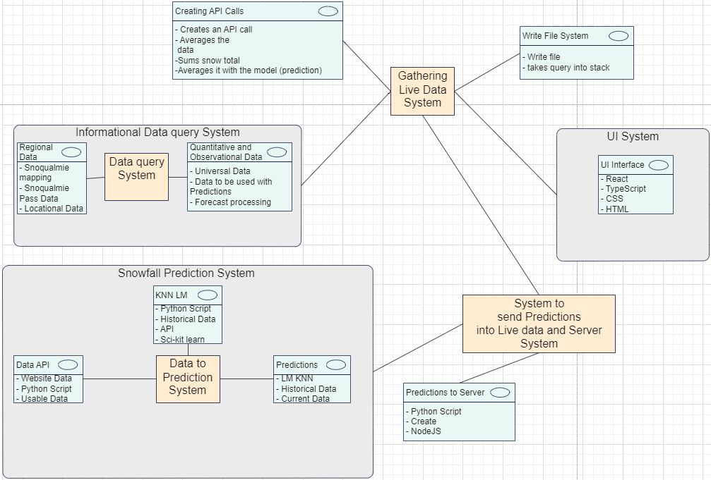

<h1> Software Design Document   for   Snow Prediction Software </h1> 

<h2> Version 1.0 approved 
 
Prepared by Frank Vanris, Conrad Nark,  Stefana Ciustea  
Bellevue College  
Instructor: Gordon Gul   
Course: CS410  

4/16/2024  </h2>

<h2>
1. Introduction    
</h2>

<h3> 1.1 Purpose  </h3>
This software design document describes the architecture and system design of the Snow Prediction software, and how reliable and usable it will be for the user.  

<h3> 1.2 Scope   </h3>
The goal for this software is to provide efficient and reliable data to the user for a given day in whether if it is going to snow or not in snoqualmie pass and how much possible snow accumulation for that given day could there be.   
<h3> 1.3 Overview  </h3>
The main gist of this document is to explain and express how the design for this software will be handled and to explain how the user will be able to use our software efficiently and reliably.  

<h3> 1.4 Reference Material   </h3>
Here are the given sources that were used to rely information for this document: 

* https://nwac.us/data-portal/location/snoqualmie-pass/
* https://api.weather.gov/points/47.3923,-121.4001
* https://www.weather.gov/documentation/services-web-api
* https://www.weather.gov/wrh/timeseries?site=SNO30
* https://depts.washington.edu/mtnhydr/Pages/NewDataPages/Snoqualmie.html
* https://www.ibm.com/topics/knn#:~:text=The%20k%2Dnearest%20neighbors%20(KNN)%20algorithm%20is%20a%20non,used%20in%20machine%20learning%20today.
* https://randomresearchai.medium.com/how-to-make-a-knn-model-in-python-5f7625bc1ab
  

<h3> 1.5 Definitions and Acronyms   </h3>

* KNN (K Nearest Neighbor: Machine learning algorithm)
* NN (Neural Networks: Machine learning algorithm)
* PD: Prediction Determinations
* DF: DataFrames (part of the pandas python library)
 

<h2> System Overview  </h2>

The goal of this software is to predict reliable data and information on a given day to the user when the user would like to know how snowy it could be on a given day. (For our time complexity a given day within 2-3 days ahead or a week).  

We will be using a learning model known as KNN to predict on a given day how much snow will fall or whether if it is going to snow at all. We will only be sending the user the average of snow fall for that given day. Not snowfall during certain hourly time intervals.   

As for where the user will be able to retrieve and see these predictions. They will find it within a website found on the web that we will be creating. A web server that will retrieve the data and our predictions, and present the information to the user.   

<h2> 3 System Architecture  </h2>
The System itself is going to be a web based application, where all the backend work is being done by parsing through given data or obtaining the given data, then shaping it so that it can easily pass through the KNN model. Then obtain the predictions and send the information to the web server that we will create.   

<h3> 3.1 Architectural Design   </h3>
Given architecture in how this will be designed is presented here in this image: 

  

* Backend Developers:Conrad Nark, Frank Vanris
* Frontend Developers: Stefana Ciustea

 
<h3> 3.2 Decomposition Description   </h3>

  

<h3> 3.3 Design Rationale   </h3>
We chose this architecture because it was easy to visualize it in a streamline scenario. We want to obtain the data then go through predictions then send the information to the user when they use the web server.   

Some issues that could occur is that certain design paradigms within this structure could be removed. For example certain issues within data analysis for our software could contain discrepensies so the software structure could change to obtaining different data or to immediatly removing the complete set of data to something reliable and usable.  

<h2> 4 Data Design   </h2>

<h3> 4.1 Data Description   </h3>
Most of the given information that will be used will be stored into DF's half of the data that we obtain as csv files will be stored into DF's in order to send the data and have it usable for the KNN algorithm. Certain sets of columns of Data could be and will sometimes be stored in it's own seperate DF. With the DF placed into the KNN algorithm we will be able to create PD's from the data. and with that information we could then send it to the user via the web server that will be established.  

<h3> 4.2 Data Dictionary   </h3>

<b>Functional Description</b>  

<h3> Functionality</h3>

<h4>Snow Prediction System</h4>

<b>Description</b>:  
The system predicts snowfall using historical data and K-Nearest Neighbors (KNN) algorithm.

<h4>Components</h4>

<h3>Data Collection</h3>

Description: Obtain a CSV file containing historical weather data (including snowfall records).

<h3>Prediction Model</h3>

Description: Train a KNN model using the historical data to predict snowfall.

<h3>Python Script</h3>
Description: Create a Python script that: 
- Takes input (e.g., date) from the user. 
- Uses the trained KNN model to predict snowfall for the specified date. 
- Sends the prediction to the React web server.

<h3>React Web Server</h3>

Description: A web server built with React that:
- Displays data to the user.
- Provides a search bar for querying specific information.
- Allows users to click a button to retrieve snowfall predictions.

<h3>User Interaction</h3>
Description:  
Users can: 

- Search for specific information (e.g., by date).
- Click a button to get snowfall predictions for the next day.
- View possible snow accumulation amounts.
  

<h2> 5. Component Design </h2>

<h3><b>Component: Data Collection</b> </h3>

* <b>Function: LoadData()</b> 

<b>Description:</b> Loads historical weather data from a CSV file. 
<b>Input:</b> Path to CSV file. 
<b>Output:</b> Data structure containing the loaded data. 
<b>Local Data:</b> CSV file path, data structure for storing weather data.  

<h3><b>Component: Prediction Model</b> </h3>

* <b>Function: TrainModel() </b> 

  * <b>Description:</b> Trains the KNN model using historical weather data. 
  * <b>Input:</b> Historical weather data structure. 
  * <b>Output:</b> Trained KNN model. 
  * <b>Local Data:</b> KNN model parameters, training dataset. 

* <b>Function: PredictSnowfall()</b> 
  * <b>Description:</b> Predicts snowfall using the trained KNN model. 
  * <b>Input:</b> Date for prediction, trained KNN model. 
  * <b>Output:</b> Snowfall prediction result. 
  * <b>Local Data:</b> Date, prediction result. 

<h3><b>Component: Python Script</b> </h3>

* <b>Function: GetUserInput()</b>

  * <b>Description:</b> Takes date input from the user. 
  * <b>Input:</b> None. 
  * <b>Output:</b> User-specified date. 
  * <b>Local Data:</b> User input date. 

* <b>Function: SendPrediction()</b> 

  * <b>Description:</b> Sends the snowfall prediction to the React web server. 
  * <b>Input:</b> Snowfall prediction result. 
  * <b>Output:</b> None. 
  * <b>Local Data:</b> Web server endpoint, prediction data. 

<h3><b>Component: React Web Server</b> </h3>

* <b>Function: DisplayData()</b> 

  * <b>Description:</b> Displays data to the user on the web interface. 
  * <b>Input:</b> Data to be displayed. 
  * <b>Output:</b> None. 
  * <b>Local Data:</b> Data to display. 

* <b>Function: SearchData()</b> 
  * <b>Description:</b> Provides a search bar for querying specific information. 
  * <b>Input:</b> Search query. 
  * <b>Output:</b> Search results. 
  * <b>Local Data:</b> Search query, search results. 

* <b>Function: RetrievePrediction()</b> 

  * <b>Description:</b> Allows users to click a button to retrieve snowfall predictions. 
  * <b>Input:</b> None. 
  * <b>Output:</b> Snowfall prediction for the next day. 
  * <b>Local Data:</b> Prediction result. 

<h3><b>Component: User Interaction</b> </h3>

* <b>Function: SearchInformation()</b> 

  * <b>Description:</b> Enables users to search for specific information by date. 
  * <b>Input:</b> Date query. 
  * <b>Output:</b> Information for the specified date. 
  * <b>Local Data:</b> Date query, search results. 

* <b>Function: GetNextDayPrediction()</b> 

  * <b>Description:</b> Allows users to get snowfall predictions for the next day. 
  * <b>Input:</b> None. 
  * <b>Output:</b> Snowfall prediction for the next day. 
  * <b>Local Data:</b> Prediction result. 

* <b>Function: ViewAccumulation()</b> 
  * <b>Description:</b> Displays possible snow accumulation amounts to the user. 
  * <b>Input:</b> None. 
  * <b>Output:</b> Snow accumulation data. 
  * <b>Local Data:</b> Accumulation data. 

<h2> 6. Human Interface Design </h2>

<h3> 6.1 Overview of User Interface </h3>

When a user opens the site, they will see a screen with a search bar and the logo to the left of it. The main focus for the user will be the central button labeled "Get Forecast." Clicking this button will open a new screen displaying the forecast for the upcoming days in a given week (with a range of 2-3 days for prediction). Each day's forecast will include predictions for whether it will snow or not. An icon on the screen will indicate if snow is expected or if another type of weather event is forecasted. If snow is predicted, the screen will also display information on how much snow is expected to accumulate over a 24-hour period.
  
In the search tab, users can look up information specific to Snoqualmie Pass. All search queries in the search bar will be limited to Snoqualmie Pass. The primary focus of the site is to predict snowfall at the Snoqualmie Pass summit. Users can search for information such as temperature, humidity, and more within the search bar.  

<h3>6.2 Screen Images </h3>

<b>Main Page:</b>
  

<b>Getting Forecast:</b>
   

<h2> 7. Requirements Tracability Matrix   </h2>
Provides a cross reference that traces components and data structures to requirements in our SRS document.
 
Table shows which system components satisfy each of the functional requirements from the SRS. In order to refer to the functional requirements, we assign them some numbers/codes in the SRS.

| Requirement-ID | Requirement Description | Design Development | Data Design Component | Interface Design Component |
| --- | --- | --- | --- | --- |
|  |  |  | | |
|  |  |  | | |
|  |  |  | | |  
|  |  |  | | |

